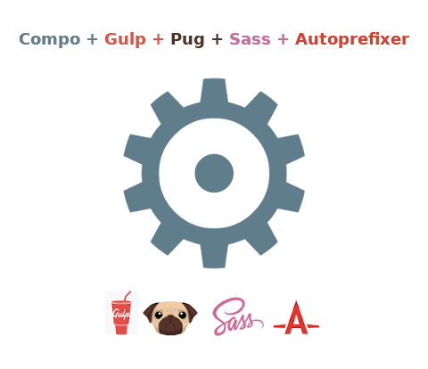
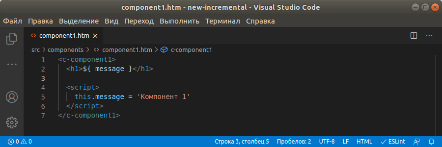
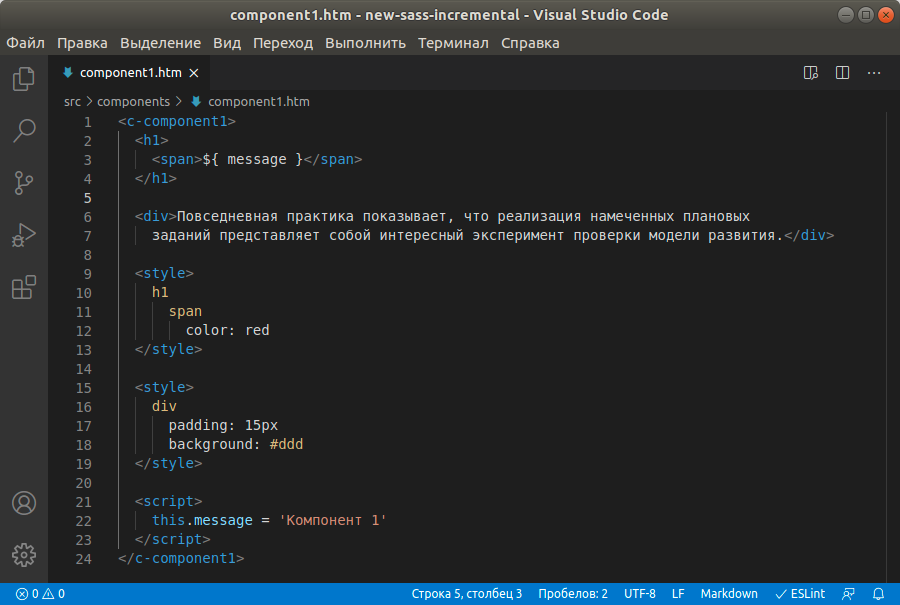
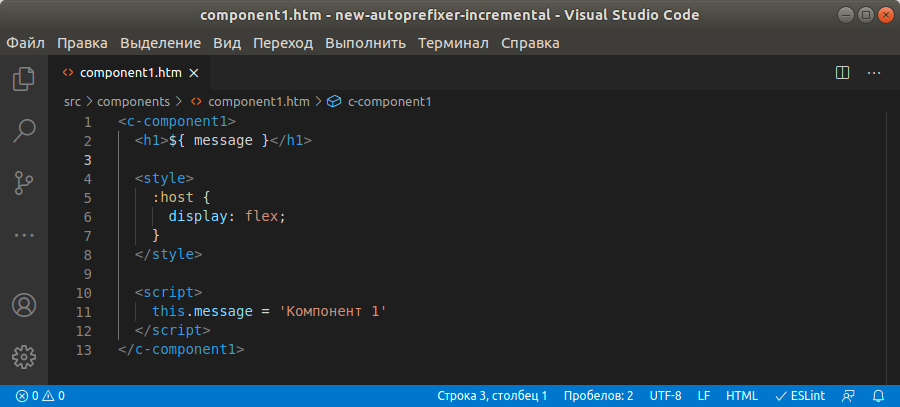
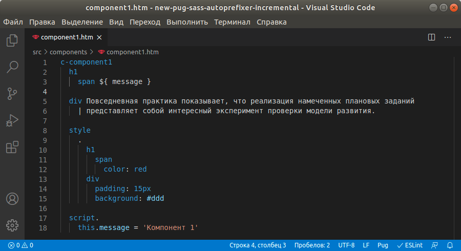
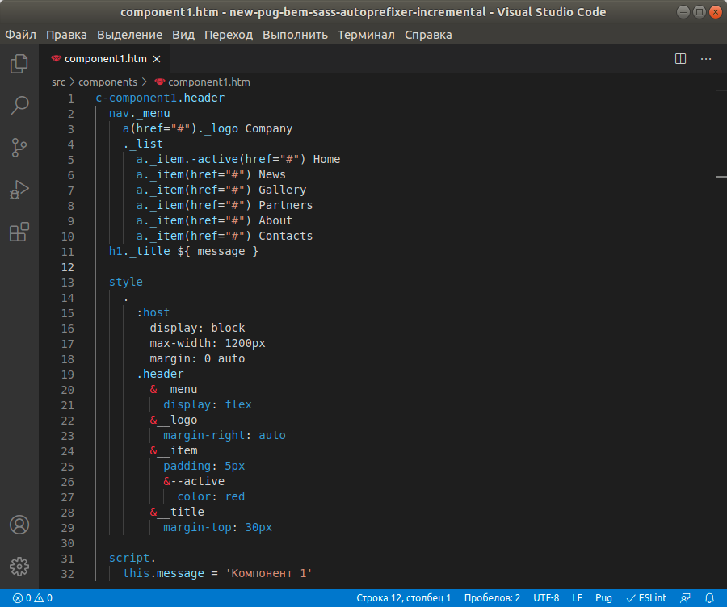

# gulp-compo-builder

**Gulp** incremental builder for **[Compo.js](http://compojs.ru/)**



## Install

```
npm i gulp-compo-builder
```

## Example

- **new-incremental**<br><br><br><br>

- **new-sass-incremental**<br><br><br><br>

- **new-autoprefixer-incremental**<br><br><br><br>

- **new-pug-sass-autoprefixer-incremental**<br><br><br><br>

- **new-pug-bem-sass-autoprefixer-incremental**<br><br><br><br>

## Author

- **[compojs.ru](http://www.compojs.ru)**

## Contacts

- **[https://vk.com/compojs](https://vk.com/compojs)**
- **[compo.js@mail.ru](mailto:compo.js@mail.ru)**
